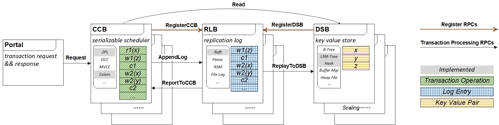

# A Composable Architecture

This repo includes the source code of our research paper: *A Composable Architecture for Cloud Transactional DBMS*.

A transactional database can be decomposed into a collection of building blocks, each of which can independently choose its own implementation and its own way to scale on the heterogeneous resources in the cloud.
These building blocks include:
 (1) a **Concurrency Control Block(CCB)** enforcing serializable schedules of transactions;
 (2) a **Replication Log Block(RLB)** ensuring the persistence of transactions and high availability; 
 (3) a **Data Storage Block(DSB)** serving data accesses.

## The architecture of the blocks

# [Prerequisite](doc/prerequisite.md)

# [TLA+ Specification](tla/tla.md)

# [Testing and Evaluation](doc/test.md)